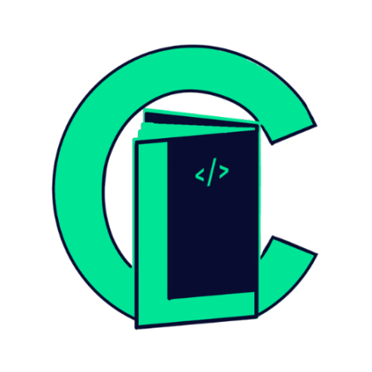

<div align="center">


 


**Verified Programming Assessment Ledger**

*BulSU Hackathon 2026 Winner — SDG 4: Quality Education*

[](https://react.dev)
[](https://vitejs.dev)
[](https://tailwindcss.com)
[](https://firebase.google.com)
[](https://ethereum.org)

</div>

---

## Overview

CrediLab is a **decentralized coding assessment platform** where students solve Java programming challenges, earn **CLB tokens** (ERC-20 on Ethereum Sepolia testnet), and build **verifiable on-chain credentials**. 

### Why CrediLab?

Traditional certifications are expensive, static, and easy to falsify. CrediLab replaces paper credentials with:

- **Tamper-proof** blockchain verification
- **Wallet-linked** proof of competence  
- **Accessible** on any device
- **Earned** through actual code execution, not self-declaration

Built on three core principles:
1. **Academic integrity** through behavioral anti-cheat monitoring
2. **Community-driven** peer validation via weekly SDG tasks
3. **Transparent** skill verification through blockchain credentials

---

## -SDG Alignment

### Primary: SDG 4 — Quality Education
**Target 4.4**: Increase the number of youth with relevant technical and vocational skills for employment and entrepreneurship. 

CrediLab provides **free, accessible skill verification** for students on low-end devices, optimized for 3G networks.

### Secondary: SDG 17 — Partnerships for the Goals
Our community feed, peer voting, and weekly SDG-themed tasks embed **cross-SDG awareness** directly into the learning experience. Students don't just code — they engage with real-world sustainability challenges (SDG 4, 9, 13, 15).

---

## Architecture

| Layer | Stack |
|-------|-------|
| **Frontend** | React 19, Vite 7, Tailwind CSS 4, CodeMirror 6 |
| **Authentication** | Firebase Auth (Google Sign-In and Email/Password) |
| **Backend** | Vercel Serverless Functions, Firebase Admin SDK |
| **Database** | Cloud Firestore |
| **Blockchain** | CLB ERC-20 token on Sepolia testnet, ethers.js 6, MetaMask |
| **Code Execution** | Judge0 CE API |
| **Mobile** | Android companion app (Kotlin), shared Firebase backend |

---

## Features

-  **Java challenges** across Easy, Medium, and Hard tiers with graduated CLB rewards
-  **Anti-cheat system** with focus-loss tracking, copy-paste detection, and automatic session termination
-  **20 achievement badges** across 5 rarity tiers with animated skill-tier frames (Novice → Expert Engineer)
-  **CLB token economy** — on-chain minting, wallet-linked credentials, blockchain-verifiable certificates
-  **Weekly SDG community tasks** with Reddit-style upvote/downvote validation and automated winner selection
-  **Hall of Fame** tab showing past weekly winners with tier frames and vote scores
-  **Real-time leaderboard** with hover profile cards, badge display, and tier progression
-  **Downloadable PDF certificates** with SHA-256 verification hashes
-  **Responsive dark/light theme**, optimized for mobile and low-bandwidth connections

---

##  Quick Start

```bash
# Clone the repository
git clone https://github.com/JeraldPascual/CrediLab.git
cd CrediLab

# Set up environment variables
cp .env.example .env
# Edit .env with your credentials

# Install dependencies
npm install

# Run development server
npm run dev
```

> **Note:** Local development calls the Judge0 CE public API directly from the browser. No Vercel deployment is required for local testing.  
> See [CONTRIBUTING.md](CONTRIBUTING.md) for full environment setup instructions.

---

##  API Endpoints

| Endpoint | Method | Purpose |
|----------|--------|---------|
| `/api/execute-code` | POST | Run user code via Judge0 CE (production proxy with auth and rate limiting) |
| `/api/reward-student` | POST | Award CLB credits for challenge completion |
| `/api/claim-tokens` | POST | Transfer Firestore credits to on-chain CLB |
| `/api/claim-pending-clb` | POST | Sync all pending CLB transfers to the blockchain |
| `/api/weekly-tasks` | GET / POST | Fetch or seed the current week's SDG task |
| `/api/award-weekly-winner` | POST | Select and reward the top-voted community submission |
| `/api/replenish-pool` | POST | Admin endpoint to top up the shared CLB credit pool |

> **Automated Winner Selection:** The weekly winner endpoint is triggered automatically each **Sunday at 18:00 UTC** via Vercel cron job. It selects the highest-netScore community-approved submission for the current ISO week and transfers CLB on-chain if a wallet is connected. The operation is **idempotent** — running it twice on the same week will not double-award.

---

##  Project Structure

```
CrediLab/
├── src/
│   ├── components/     # Reusable UI: Sidebar, TierFrame, UserProfileCard, ProtectedRoute
│   ├── pages/          # Route views: Dashboard, CodingPortal, CommunityFeed, Leaderboard
│   ├── context/        # React context: AuthContext, ThemeContext
│   ├── hooks/          # Custom hooks: useAntiCheat
│   ├── data/           # Challenges, badges, weekly tasks, codec utilities
│   ├── lib/            # Firebase client configuration
│   └── utils/          # Code execution helpers
├── api/                # Vercel serverless functions
├── web3/               # Blockchain integration: MetaMask, WalletConnect, helpers
├── public/             # Static assets
└── project_context/    # Hackathon documentation and rules
```

---

##  Environment Variables

| Variable | Purpose |
|----------|---------|
| `VITE_FIREBASE_*` | Firebase client config (API key, project ID, etc.) |
| `FIREBASE_SERVICE_ACCOUNT` | Firebase Admin SDK credentials (JSON stringified) |
| `ADMIN_SECRET` | Auth token for manual admin API calls |
| `CRON_SECRET` | Auth token used by Vercel cron for the weekly winner job |
| `SYSTEM_WALLET_PRIVATE_KEY` | Platform wallet private key for on-chain CLB transfers |
| `VITE_CLB_CONTRACT_ADDRESS` | Deployed CLB ERC-20 contract address on Sepolia |
| `VITE_SEPOLIA_RPC_URL` | Sepolia RPC endpoint |

See [`.env.example`](.env.example) for the full list with descriptions.

---

##  Naming Disclosure

This project was independently developed for the **BulSU Hackathon 2026**. The name "CrediLab" was chosen by this team to reflect **credential-based learning** and was selected without knowledge of any prior use.

It has since come to our attention that an unrelated organization in Malaysia operates under the same name in a different domain (financial services and credit accessibility). This team has **no affiliation with, knowledge of, or derived work from that entity**. The name was independently conceived, and the concept, architecture, codebase, and application domain are entirely original.

This disclosure is made voluntarily in accordance with **Sections VIII and XIV** of the BulSU Hackathon rules, which require originality, transparency about pre-existing resources, and avoidance of plagiarism. The name overlap is coincidental. Should the organizers require it, this team is prepared to rename the project for any post-hackathon continuation without affecting the substance of the submission.

---

##  License

Built for the **BulSU Hackathon 2026**. See [HACKATHON_RULES.md](project_context/HACKATHON_RULES.md) for contest terms and code of conduct.

**Copyright 2026** — Jerald Pascual and contributors.

---

<div align="center">

Made with ❤️ for SDG 4: Quality Education

**[⭐ Star this repo](https://github.com/JeraldPascual/CrediLab)** • **[🐛 Report Issues](https://github.com/JeraldPascual/CrediLab/issues)** • **[💬 Discussions](https://github.com/JeraldPascual/CrediLab/discussions)**

</div>
